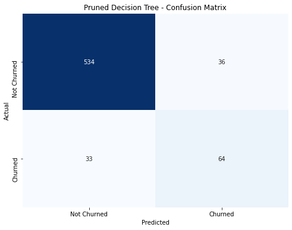

# Project 5 Telecom Churn

## Overview/Business Understanding
Tasked with creating a classifier to predict whether SyriaTel customers will churn so they can reduce how much money is lost on customers who won't be sticking much longer, can focus on retention, and identify. This will help them recognize patterns of leaving customers.

## Data Understanding and Analysis
Data is taken from [Kaggle]("https://www.kaggle.com/datasets/becksddf/churn-in-telecoms-dataset") Contains 3333 rows of customers and 21 columns. Our data contains information on phone use, account length, where they are from etc. Our data does have an innate imbalance because it hurts our company far more to falsely identify someone as retained when they will actually churn than it will to send a simple rention email to someone who will stay than to make no attempt to someone who will probably leave.

### Visualizations used in analysis
Confusion Matrix of Final Model

## Evaluation and Limitations
Our best performing model was a pruned Decision Tree which was accurately able to predict churn with 90% accuracy. However, due to the limited amount of data as well as the imbalance in our churn target variable in this instance we care more about our recall metric. 
Our recall metrics measures how correctly our model was able to correctly identify customers who would churn. The reason we care about this over all other metrics is due to to the fact that it hurts our company more to lose a customer we thought would stay than it is to attempt retention efforts toward someone who has no plans on leaving as that will be a minor inconvenience for them.
Our Recall was again 76% with the most important features being total day minutes, customer service calls and if they had an international plan.

With a larger dataset it is absolutely possible to improve our model even further. Many academic articles have approached this problem as well including one that was able to attain a 99% accuracy, 99% precision score as well as a 99.01% recall score cited below

Wagh, S. K., Andhale, A. A., Wagh, K. S., Pansare, J. R., Ambadekar, S. P., & Gawande, S. (2023). Customer churn prediction in telecom sector using machine learning techniques. Results in Control and Optimization, 14, 100342. https://doi.org/10.1016/j.rico.2023.100342

## Conclusion/Recommendation
Use this model to save company money, work with our marketing team and collect more data to train a more robust machine learning model:
\n Focus retention efforts on the following features:
* Total day minutes
* Customer service calls
    * Especially customers who have had to call in more than 2 times
* Customers with intenational plans

### Navigating the Repository
* data
    * bigml_59c28831336c6604c800002a.csv
    * telecom_churn.csv
* images
    * decision-tree-pruned-confusion-matrix.png
* .gitignore
* README.md
* project-5-customer-churn.ipynb
* chapter-5-presentation-churn.pdf

### Link to Presentation
[project-5-churn-presentation](https://github.com/jaredlil/project-5-telecom-churn/blob/main/chapter-5-presentation-churn.pdf)
### Link to Blog
https://datasciencedigested.blogspot.com/2024/08/wasted-time-and-effort.html